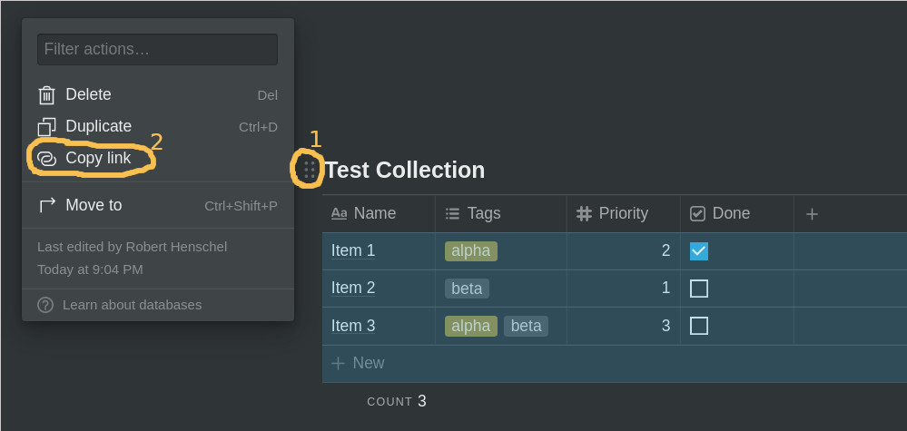
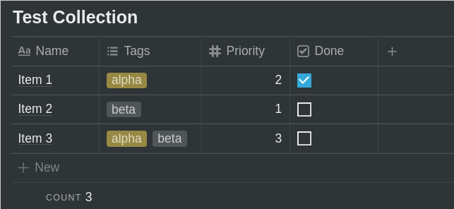
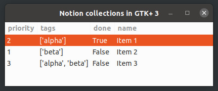
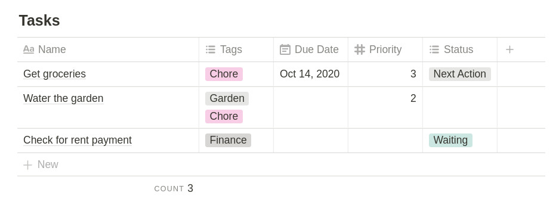
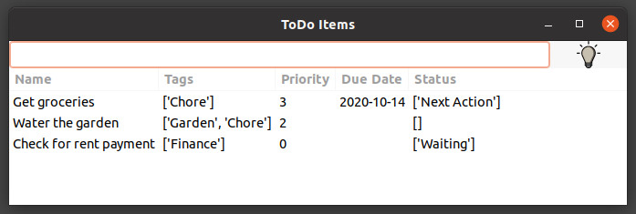

# Overview
The purpose of this project is to interact with collections in [Notion.so](https://www.notion.so) from Python GTK+ 3 applications. The applications in this repository are meant for developers that are new to GTK+ 3 and the unofficial [Python Notion API](https://github.com/jamalex/notion-py). This project relies heavily on [notion-py](https://github.com/jamalex/notion-py) to connect and download data from Notion.so and [Treeview example code](https://python-gtk-3-tutorial.readthedocs.io/en/latest/treeview.html) of the Python GTK+ 3 Tutorial.

## Disclaimer

This is my first attempt at building Python GTK+ applications and I don't claim that I have followed best practices for any of my code. If you have suggestions for improvements, please open an issue or create a pull request.
This code is mostly intended as a starting point and can be extended in various ways. There should be enough code here to give you an idea of how to get the data and display it.

## Installation and Configuration

Before running any of the applications, you need to make 2 changes to *config.dat*. Those changes are different for every user, so no default values are provided. The format of *config.dat* is a basic *key = value* pair.

The first entry that needs to be set in *config.dat* is *token_v2*, which is the access token to your Notion account. You can find that token by looking at cookies that the notion website stores in your browser. The value you are looking for is called *token_v2* and it is stored in a cookie for *www.notion.so*. You are looking for a value that is 150 or more characters long and contains letters and digits. (more information about obtaining the correct value is available in the [Quickstart section](https://github.com/jamalex/notion-py#quickstart) of the documentation of the notion-py package.)

The other entry in *config.dat* is *collectionID*, which is the URL to the collection/table in Notion. You can retrieve this by navigating to the collection in your browser and then open the *menu* for the collection and copy the link for the collection. What you are looking for is the link to the collection, not the link to the page that contains the collection! Here is a picture that may help point you in the right direction. 



*config.dat* should look something like this, just with way longer lines:

```
token_v2 = 62acf60905ad9f28df60905ad9f28...
collectionID = https://www.notion.so/82f1240e0f89...
```
Once *config.dat* is updated you should be good to run the applications.

# notionTableGTK

This is the most basic and most generic example. This application retrieves the content of a Notion collection and display it in a GTK+ 3 Treeview widget.

## Features and Limitations

This application should work for arbitrary collections in Notion, but was only tested on a few examples. All property types of a Notion collection are converted to a *string* in python, which may not be optimal for displaying them. Customizations to the view of a collection are not preserved, meaning filters and custom sort orders are ignored. Both features could be implemented through the notion-py API or in the tree view list store. The application has only been tested on Linux, please use at your own risk!

## Example Output

Here is a screen shot of what a collection in Notion looks like, and how it is displayed in the GTK+ 3 Treeview widget.



# notionToDoGTK

This application is an extension of notionTableGTK but does **NOT** work with arbitrary collections in Notion. This application only works with collections that have exactly 5 properties (or columns); the application is geared towards a collection that holds basic ToDo items. The column names **do matter** and have to be setup as follows: Name, Tags, Priority, Due Date, Status.

## Features and Limitations

This application shows a few more features of the notion-py API as well as GTK+ 3, but has very limited error handling. The application reads the collection from Notion and displays it in a Treeview widget. The application also allows for adding new items to the collection as well as deleting items from the collection. In both cases, the changes performed in the GTK+ applications are also reflected in the Notion collection. Here are few more features of the application:

- Threading for all interactions with the notion API, and a "busy indicator" indicating to the user that there is work going on in the background (the little lamp in the top right hand corner turns on while API calls are in progress).
- Ability to add a new row to the collection in Notion, with custom text and some default values.
- Using a context menu of a row, one can delete a row both in the Treeview and in Notion

And here are some of the Limitations of the application:

- Item deletion is done by matching the name of the item in the row against the name in the collection. That method fails if there are multiple items with the same name. The application detects that and prints a message to the command line.
- Column names are hard coded and so is the sequence of the columns and there are implicit dependencies on the sequence of items stored in the Treeview list store.
- The application does only allow for adding and deleting rows, it is not possible to edit any properties.
- Very limited error checking and handling.

The application has only been tested on Linux, please use at your own risk!

## Example Output

Here is a screen shot of what a ToDo collection in Notion looks like, and how it is displayed in the GTK+ 3 Treeview widget.

 
